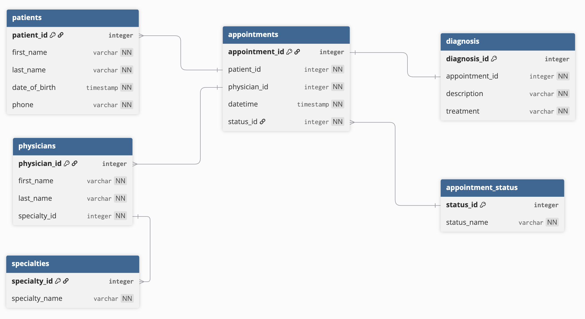

# Task 1
## Entities
### Patient
- patient_id (PK)
- first_name
- last_name
- date_of_birth
- phone

### Physician
- physician_id (PK)
- first_name
- last_name
- specialty_id (FK)

### Specialty
- specialty_id (PK)
- name

### Appointment
- appointment_id (PK)
- patient_id (FK)
- physician_id (FK)
- date_time
- status_id (FK)

### Appointment_Status
- status_id (PK)
- status_name

### Diagnosis
- diagnosis_id
- appointment_id (PK)
- description
- treatment

## Relations
- Patient 1:N Appointment
- Physician 1:N Appointment
- Appointment 1:1 Diagnosis
- Appointment N:1 Appointment_Status
- Specialty 1:N Physician

# Task 2

# Task 3

PATIENTS(
patient_id INT PRIMARY KEY,
first_name VARCHAR(50) NOT NULL,
last_name VARCHAR(50) NOT NULL,
date_of_birth TIMESTAMP NOT NULL,
phone VARCHAR(20) NOT NULL
)

PHYSICIANS(
physician_id INT PRIMARY KEY,
first_name VARCHAR(50) NOT NULL,
last_name VARCHAR(50) NOT NULL,
specialty_id INT NOT NULL,
FOREIGN KEY (specialty_id) REFERENCES specialties(specialty_id)
)

SPECIALTIES(
specialty_id INT PRIMARY KEY,
specialty_name VARCHAR(50) NOT NULL
)

APPOINTMENTS(
appointment_id INT PRIMARY KEY,
patient_id INT NOT NULL,
physician_id INT NOT NULL,
status_id INT NOT NULL,
date_time TIMESTAMP NOT NULL,
FOREIGN KEY (patient_id) REFERENCES patients(patient_id),
FOREIGN KEY (physician_id) REFERENCES physicians(physician_id),
FOREIGN KEY (status_id) REFERENCES appointment_status(status_id)
)

APPOINTMENT_STATUS(
status_id INT PRIMARY KEY,
status_name VARCHAR(50) NOT NULL
)

DIAGNOSIS(
diagnosis_id INT PRIMARY KEY,
appointment_id INT NOT NULL UNIQUE,
description VARCHAR(100) NOT NULL,
treatment VARCHAR(100) NOT NULL,
FOREIGN KEY (appointment_id) REFERENCES appointments(appointment_id)
)

